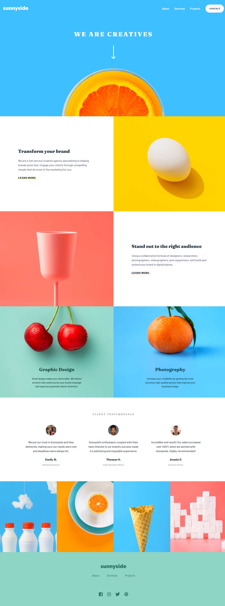

# Frontend Mentor - Sunnyside agency landing page solution

This is a solution to the [Sunnyside agency landing page challenge on Frontend Mentor](https://www.frontendmentor.io/challenges/sunnyside-agency-landing-page-7yVs3B6ef). Frontend Mentor challenges help you improve your coding skills by building realistic projects.

## Table of contents

- [Overview](#overview)
  - [The challenge](#the-challenge)
  - [Screenshot](#screenshot)
  - [Links](#links)
- [My process](#my-process)
  - [Built with](#built-with)
  - [What I learned](#what-i-learned)
  - [Continued development](#continued-development)
  - [Useful resources](#useful-resources)
- [Author](#author)

## Overview

### The challenge

Users should be able to:

- View the optimal layout for the site depending on their device's screen size
- See hover states for all interactive elements on the page

### Screenshot

### Links

- Solution URL: [https://www.frontendmentor.io/solutions/sunnyside-landing-page-built-using-sass-and-vanilla-javascript-N6Mv80KNI9](https://www.frontendmentor.io/solutions/sunnyside-landing-page-built-using-sass-and-vanilla-javascript-N6Mv80KNI9)
- Live Site URL: [https://sunnyside-landing-page-ai.netlify.app/](https://sunnyside-landing-page-ai.netlify.app/)

## My process

### Built with

- Semantic HTML5 markup
- CSS custom properties
- Flexbox
- CSS Grid
- Mobile-first workflow
- Sass using SCSS syntax
- Vanilla JavaScript

### What I learned

By building this project I practiced my JavaScript and CSS skills, in case of CSS it was using SASS and CSS Grid and Flexbox. In case of JavaScript it was DOM manipulaton.

### Continued development

In the future I'd like to learn more advanced properties of CSS Grid and get more comfortable using it where it's more appropriate.

### Useful resources

On this [link](https://www.learnhowtoprogram.com/user-interfaces/building-layouts-preprocessors/7-1-sass-architecture) you can learn more about Sass 7-1 Architecture that I used to structure my Sass in this project.

On this [link](http://getbem.com/) you can learn more about BEM naming convention that I used to name my classes in this project.

## Author

- Frontend Mentor - [@andrijaivkovic](https://www.frontendmentor.io/profile/andrijaivkovic)
- Twitter - [@AndrijaIvkovic1](https://www.twitter.com/AndrijaIvkovic1)
